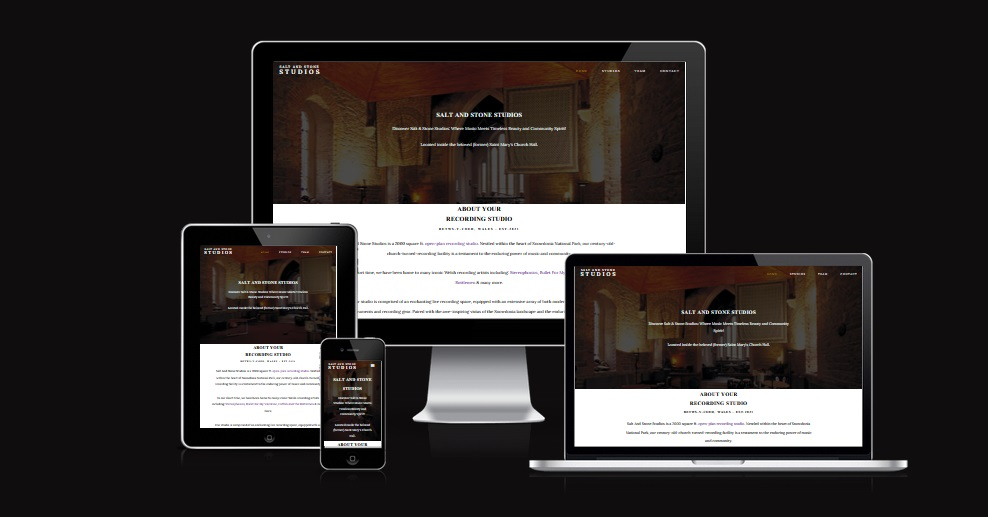

# Salt And Stone Studios - My Milestone Project

Welcome to my first milestone project, Salt And Stone Studios.

After ten years in the Construction Industry, I decided it was time for a change. I have always had an interest in computing and had always dreamed of having a job where I could utilise my computer skills, but the opportunity never came. Earlier this year, I decided to take a leap of faith and enroll in a Full Stack Development course.

The purpose of this project is to demonstrate my learning and understanding of the HTML and CSS modules that I have completed thus far and to implement them into a live project. This was a great opportunity to showcase my skills in design and development. The project is a fucntional website, built with HTML and CSS.

Below, I will outline each step of the process and my reasonings used to plan this project. I will reference my sources and highlight my focus on user experience design.

Thank you for taking the time to view my project and I truly hope you enjoy it as much as I did designing and developing it.

## UX - User Experience Design

The inspiration behind the planning of this project comes largely from my love of music and lifelong dream of establishing my on recording studio (purely for my hobbies and not for a career!). I am a musician myself and I've always been inspired by the great creatives of our generation. By thinking of the user experience through each step of this design journey, it has resulted in a more positive experience and general feel.

I have broken down the planning into the five planes:
- __The Strategy Plane__ 
- __The Scope Plane__
- __The Structure Plane__
- __The Skeleton Plane__
- __The Surface Plane__
  

## Strategy Plane

My aim as the creator of this project is to instill the inspiration that I feel towards music and companionship.

#### Creator Stories

Creator Goals
- I aim to ensure my project is easy to navigate.
- Due to my project being a mostly information-based site, I don't want my users to get lost in the text.
- As a creator, I strive to onvoke positive emotional responses from users.
- My content should be relatable. Any images, text or quotes should have purpose.
- I don't want to overload my users with information so I need to invest time into establishing a structure that works well for my project. It should ease the user in.

Once I established my strategy, the most important consideration from the user's perspective was how a user would feel going through the project.

#### User Stories

First-time visitor goals:

- As a first-time visitor, I want instant clarity about the project's purpose upon landing on the page.
- I desire effortless navigation - the ability to return to the home page quickly and a seemless way to move forward without needing to scroll back through the content.
- I hope to find reinforcement and support for the content that I am consuming through quotes, stories or images.
- I aim to experience a sense of progression while navigating the page without feeling overwhelmed or lost.
- I want to enjoy a visualy engaging experience without becoming fatigued.

Returning visitor goals

- As a revisiting user, I aim to establish contact with the creator or creators, either through social links or a dedicated contact page.
- I seek the ability to reference information sources or discover the origins of the provided content.

The user stories empower me to develop a clearer concept of the project's feature requirements and their relative priorities.

During my initial planning, I researched local studios in the area and reviewed their websites. Many of these websites overloaded their users with so much content, whereas others went in the other direction and had very minimal information about the studio and the services they provided. 

I asked my friends and fellow musicians, what elements of a music studio that they would be concerned with and their responses helped me to establish the core content for the website and where my focus should be.

## Scope Plane

Based on my strategy goals, I was able to establish that I wouldn't be able to implement everything that I had thought of and the suggestions of what users would like to see. It simply wasn't feasible for my initial release. 

The easiest solution for me to start was a minimum viable product, which would provide the core content that I had deduced from my research.

From this, I was able to split my project into three phases.

#### Phase 1 - 

- A home page with an introduction to the project, which I decided should also host the "About" content.
- A studios page where I could detail the space provided.
- A 'Meet The Team' page to introduce the team. This was an essential element as it was a consideration my fellow musicians regarded highly.
- A 'Contact Us' page, complete with a form to allow users to get in touch.

#### Phase 2 - 

- An expansion on both the 'Studios' and 'Meet The Team' pages, complete with additional images.
- Further refining of all of the styles throughout the website, allowing for consistency.

#### Phase 3 (Future Features) -
- Interactive Elements (to be implemented once I have knowledge of JavaScript)
- Light Mode/Dark Mode toggle 

Having a phased approach would allow me to release a functional website, containing all of the fundamental content that my users desire while allowing me to refine my design, better understand my flaws and collect feedback.

## Structure Plane

## Skeleton Plane

## Surface Plane

Salt And Stone is a site that aims to attract and inspire musicians to come and join us in their creative endeavours. The site encourages positivity and promotes a healthy connection to the world. The target audience for this site will be musicians of all calber, film-makers and media enthusiasts alike. Salt And Stone will be useful for all interested parties who are looking for a creative space to bring their ideas to life. All information that they require will be available throughout the site, along with a comprehensive contact list for any queries beyond the original scope of the site and a booking form.

<a href="https://hcaldwell95.github.io/salt-and-stone-studios/">View live project here</a>

## Features

In this section, you should go over the different parts of your project, and describe each in a sentence or so. You will need to explain what value each of the features provides for the user, focusing on who this website is for, what it is that they want to achieve and how your project is the best way to help them achieve these things.

### Existing Features SCREENSHOTS OF FEATURE DISCUSSING - EVERYTHING IS A FEATURE EVEN PARAGRAPHS

- __Navigation Bar__

  - Featured on all three pages, the full responsive navigation bar includes links to the Logo, Home page, Gallery and Sign Up page and is identical in each page to allow for easy navigation.
  - This section will allow the user to easily navigate from page to page across all devices without having to revert back to the previous page via the ‘back’ button.

- __The landing page image__

  - The landing includes a photograph with text overlay to allow the user to see exactly which location this site would be applicable to.
  - This section introduces the user to Love Running with an eye catching animation to grab their attention

- __Club Ethos Section__

  - The club ethos section will allow the user to see the benefits of joining the Love Running meetups, as well as the benefits of running overall.
  - This user will see the value of signing up for the Love Running meetups. This should encourage the user to consider running as their form of exercise.

- __Meetup Times section__

  - This section will allow the user to see exactly when the meetups will happen, where they will be located and how long the run will be in kilometers.
  - This section will be updated as these times change to keep the user up to date.

- __The Footer__

  - The footer section includes links to the relevant social media sites for Love Running. The links will open to a new tab to allow easy navigation for the user.
  - The footer is valuable to the user as it encourages them to keep connected via social media

- __Gallery__

  - The gallery will provide the user with supporting images to see what the meet ups look like.
  - This section is valuable to the user as they will be able to easily identify the types of events the organisation puts together.

- __The Sign Up Page__

  - This page will allow the user to get signed up to Love Running to start their running journey with the community. The user will be able specify if they would like to take part in road, trail or both types of running. The user will be asked to submit their full name and email address.

For some/all of your features, you may choose to reference the specific project files that implement them.

In addition, you may also use this section to discuss plans for additional features to be implemented in the future:

### Features Left to Implement NOT REQUIRED 

- Another feature idea

## Testing MOST IMPORTANT - EVERYTHING NOT MENTIONED WILL BE IGNORED. BREAKDOWN PROJECT SIMILAR TO FEATURES AND EXPLAIN HOW IT HAS BEEN TESTED. TEST RESPONSIVENESS AND EFFECTS ETC SOCIAL MEDIA TO NEW PAGE AND CORRECT SITE - 

In this section, you need to convince the assessor that you have conducted enough testing to legitimately believe that the site works well. Essentially, in this part you will want to go over all of your project’s features and ensure that they all work as intended, with the project providing an easy and straightforward way for the users to achieve their goals.

In addition, you should mention in this section how your project looks and works on different browsers and screen sizes.

You should also mention in this section any interesting bugs or problems you discovered during your testing, even if you haven't addressed them yet.

If this section grows too long, you may want to split it off into a separate file and link to it from here.

### Validator Testing DONE LIGHTHOUSE (IF)

- HTML
  - No errors were returned when passing through the official [W3C validator](https://validator.w3.org/nu/?doc=https%3A%2F%2Fcode-institute-org.github.io%2Flove-running-2.0%2Findex.html)
- CSS
  - No errors were found when passing through the official [(Jigsaw) validator](https://jigsaw.w3.org/css-validator/validator?uri=https%3A%2F%2Fvalidator.w3.org%2Fnu%2F%3Fdoc%3Dhttps%253A%252F%252Fcode-institute-org.github.io%252Flove-running-2.0%252Findex.html&profile=css3svg&usermedium=all&warning=1&vextwarning=&lang=en#css)

### Unfixed Bugs NO SITE BREAKING BUGS IS FINE - NOTE FINDINGS

You will need to mention unfixed bugs and why they were not fixed. This section should include shortcomings of the frameworks or technologies used. Although time can be a big variable to consider, paucity of time and difficulty understanding implementation is not a valid reason to leave bugs unfixed.

## Deployment

#### Github

This project is deployed using GitHub pages using the following process,

#### Deploying a GitHub Repository via GitHub Pages

1. In your <em>Repository</em> section, select the <em>Repository</em> you wish to deploy.
2. In the top horizontal Menu, locate and click the <em>Settings</em> link.
3. Inside the <em>Setting</em> page, around halfway down locate the <em>GitHub Pages</em> Section.
4. Under <em>Source</em>, select the None tab and change it to <em>Main</em> and click <em>Save</em>.
5. Finally once the page resets scroll back down to the <em>GitHub Pages</em> Section to see the following message "Your site is ready to be published at (<em>Link to the GitHub Page Web Address</em>)". It can take time for the link to open your project initially, so please don't be worried if it down not load immediately.

#### Forking the Github Repository

You can fork a GitHub Repository to make a copy of the original repository to view or make changes without it affecting the original repository.

1. Find the GitHub repository.
2. At the top of the page to the right, under your account, click the <em>Fork</em> button.
3. You will now have a copy of the repository in your GitHub account.

#### Making a Local Clone

1. Find the GitHub Repository.
2. <em>Click</em> the Code button
3. <em>Copy</em> the link shown.
4. In <em>Gitpod</em>, change the directory to the location you would like the cloned directory to be located.
5. <em>Type</em> <code>git clone</code>, and <em>paste</em> the link you copied in step 3.
6. Press <em>Enter</em> to have the local clone created.

The live link can be found here - <https://github.com/HCaldwell95/salt-and-stone-studios>

## Credits - CODE REFERENCES - MENTION CODE INSTITUTE - IMAGES (LINK INSTAGRAM) PIXELS / UNSPLASH - GOOGLE IMAGES SEARCH CORRECT: LINK TO SITE OR PAGE MULTIPLE SOURCES AND LINKS IN BULLET POINTS (NO COPYRIGHT TEXT) PROJECT MADE SOLELY FOR EDUCATIONAL PURPOSE

In this section you need to reference where you got your content, media and extra help from. It is common practice to use code from other repositories and tutorials, however, it is important to be very specific about these sources to avoid plagiarism.

You can break the credits section up into Content and Media, depending on what you have included in your project.

### Content

#### Code

- <a href="https://codeinstitute.net/">Code Institute, Various Tutors</a>
  - Helped me to find solutions to many of my coding issues/queries and allowed me to refer to specific modules for further guidance.

- <a href="https://www.youtube.com/@OnlineTutorialsYT">Online Tutorials</a>
  - Idea for the contact us page and form taken from their video. <a href="https://www.youtube.com/watch?v=gggB0Nq5vBk&t=654s">Link to video</a>

- <a href="https://www.w3.org/">World Wide Web Consortium (W3C)</a>
  - Provided access to many 'How To' pages, namely the contact cards in contact.html. Provided specific guide for 'Meet The Team' cards. <a href="https://www.w3schools.com/howto/howto_css_team.asp">Link to page</a>

- The text for the Home page was taken from Wikipedia Article A
- Instructions on how to implement form validation on the Sign Up page was taken from [Specific YouTube Tutorial](https://www.youtube.com/)
- The icons in the footer were taken from [Font Awesome](https://fontawesome.com/)

### Media

- <a href="https://www.google.co.uk/">Google Images</a>
  - All of my images have been pulled from a google search:
    - https://www.soundonsound.com/people/brendan-perry-quivvy-studio-church-music
    - https://www.visitsnowdonia.info/sites/default/files/styles/home_hero_carousel_1400x600_/public/Llyn%20Llydaw%2C%20Snowdon%20-%20Yr%20Wyddfa%201400%20600.png?itok=QfjqcYiL
    - https://bravewords.com/medias-static/images/news/2015/556DB266-bullet-for-my-valentine-post-venom-studio-diary-part-one-video-image.jpg
    - https://www.telegraph.co.uk/content/dam/music/2015-08/Aug26/Stereophonics.jpg?imwidth=680
    - https://www.pmtonline.co.uk/media/blog/BEST-AUDIO-MIXERS-d.jpg
    - https://media.istockphoto.com/id/1342954577/photo/
    - https://www.insauga.com/alexisonfire-headlines-st-catharines-born-raised-summer-shows/
    - https://i1.pickpik.com/photos/949/859/697/background-black-coffee-coffee-desk-preview.jpg
    - https://www.rawmusictv.com/images/og-share-image/wade-macneil.jpg
    - https://magnetmagazine.com/wp-content/uploads/2023/03/CC-683x1024.jpg
    - https://i.ytimg.com/vi/WnVdSogBNXM/maxresdefault.jpg
  
- <a href="https://ui.dev/amiresponsive?url=https://hcaldwell95.github.io/salt-and-stone-studios/">Am I Responsive?</a> - Provided image used at the top of README.md to demonstrate responsiveness.
 

- <a href="https://www.youtube.com/channel/UCbd18DQEmUApY3vE_N9UYOg">Youtube @ City And Colour</a> - The embedded video on my home page is from City And Colour's Youtube page.
<a href="https://www.youtube.com/watch?v=DPjf5fGwQg0">Link to video</a>

 

- The icons throughout were taken from <a href="https://fontawesome.com/">Font Awesome</a>.

## Other General Project Advice

#### CodeAnywhere

I encounted multiple issues with this IDE. From losing my progress on multiple occasions to workspaces simply being corrupt and unable to open. Part way through the project, I switched over to GitPod. This left me with concerns that my git commits may not be consistent.

#### GitHub

During this project, my account was migrated to a Code Institute student account. All of my repositories and access remained, but when reviewing the git logs, there is a difference shown between my profile during this stage. Both profiles share the name of HCaldwell95, but at first glance it appears that the git commits come from another user. I can confirm that all commits have been from myself and no other user has ever accessed my project. I believe this is due to the account migration.